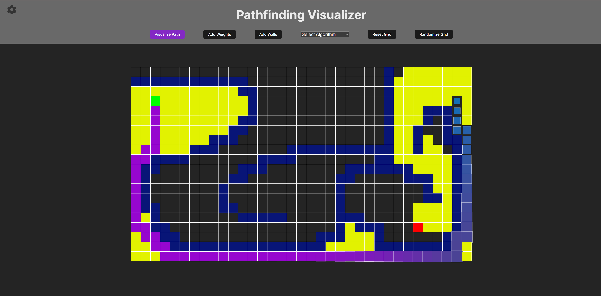

# 🧭 Pathfinding Visualizer

A web-based visualizer for popular pathfinding algorithms like **A\***, **Dijkstra**, **BFS**, and **DFS**. Built with **React**, this tool lets you interactively explore how different algorithms find paths between two points on a grid.


---

## ✨ Features

- 🎯 **Supported Algorithms**
  - A\* (default)
  - Dijkstra's Algorithm
  - Breadth-First Search (BFS)
  - Depth-First Search (DFS)

- 🧱 **Grid Interaction**
  - Add/remove walls
  - Add weighted nodes
  - Drag start and end nodes

- 🎨 **Sidebar Tools**
  - Toggle modes: Add walls, Add weights, Move nodes
  - Customize node colors (start, end, wall, path, visited)

- ⚡ **Visualization**
  - Step-by-step animated traversal
  - Instant path rendering
  - Colorful, responsive UI

---

## 🛠 Installation

1. Clone the repo:
   ```bash
   git clone https://github.com/your-username/pathfinding-visualizer.git
   cd pathfinding-visualizer
   ```
2. Install dependencies:
   ```bash
   npm install
   ```
3. Run the app:
    ```
    npm run dev
    ```
4. Open in your browser:
    ```
    http://localhost:5173
    ```